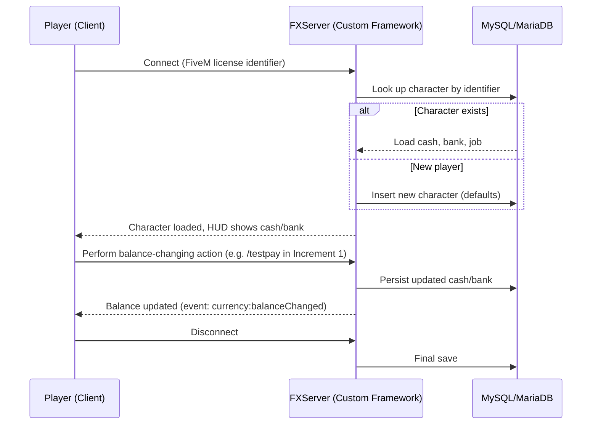

# Product Requirements Document — Custom FiveM Roleplay Server

## Product Vision

A custom-built FiveM roleplay (RP) server — not built on QBCore, QBox, or ESX.
Gameplay logic and conventions (jobs, economy, character data model) will be
designed from scratch, but built on top of standard, ecosystem-wide low-level
libraries (`ox_lib`, `oxmysql`, `ox_target`) rather than reinventing UI,
database access, and interaction primitives.

The server runs on vanilla Los Santos (no custom map) with proximity voice
chat, and is hosted on an Azure VM. It is built and operated by a small team
(2–5 people). Admin tooling and anti-cheat protection are treated as
essential from day one, not an afterthought.

This PRD deliberately covers only what has been decided. Several major
product dimensions (theme, factions, monetization, launch timeline) are
explicitly deferred — see **Out of Scope / Deferred Decisions** below — so
that this document does not lock in decisions that haven't actually been
made yet.

## Target Users / Actors

| Actor | Description |
|---|---|
| Player | Connects to the server, controls exactly one character (single-character model), earns and spends in-game currency |
| Server Admin / Staff | Moderates players, has elevated commands for support and testing (e.g. adjusting a player's balance to correct a bug) |
| *(Future)* Job/Faction roles | Not yet defined — deferred to Increment 2+ |

## Delivery Strategy — Incremental

Per the project's "walking skeleton first" principle, delivery is split so the
architecture is proven before content (jobs, factions, theme) is layered on:

| Increment | Goal | Status |
|---|---|---|
| **Increment 1 — Economic Foundation** | Custom framework core, database schema, character session lifecycle, and a persistent dual-balance (cash/bank) currency system. No job content. | **This PRD's scope** — see `specs/frd-core-framework.md`, `specs/frd-currency-system.md` |
| Increment 2 — Job Variety | Multiple job types that pay into the Increment 1 currency system, salary/pay balancing | Deferred — planned after Increment 1 ships |
| Increment 3+ | Factions/gangs, theme/setting, monetization, custom mechanics | Deferred — not yet scoped |

## Increment 1 Scope — Economic Foundation

The concrete deliverable of this PRD: a functional, deployable "blank slate"
server where a player can connect, have a character created and persisted,
and see a working, saving cash/bank balance — with no real jobs yet, but with
the extensibility points in place so Increment 2 can add jobs without
reworking the foundation.

Covered by two FRDs:
- **`specs/frd-core-framework.md`** — server bootstrap, standard library
  dependencies, database schema, player identification, character
  load/save lifecycle, and the extensibility contract future job resources
  will use.
- **`specs/frd-currency-system.md`** — the dual-balance (cash + bank)
  currency system: atomic transactions, persistence, admin/test tooling to
  prove the loop works end-to-end.

## Non-Functional Requirements

- **Hosting:** Azure VM running FXServer + txAdmin (Linux recommended for
  production; final sizing is a tech-stack/infra decision, not fixed here).
- **Database:** MySQL/MariaDB, accessed exclusively through `oxmysql`
  (async, parameterized queries — no raw string-concatenated SQL anywhere).
- **Shared libraries:** `ox_lib` (UI/notifications/callbacks) and
  `ox_target` (world interactions) are foundational dependencies for all
  future resources, not just this increment.
- **Data integrity:** currency persistence must be crash-safe (a server
  crash must not silently lose more than the single most recent in-flight
  transaction) and resistant to duplication exploits.
- **Extensibility:** the character/currency data model must not require a
  breaking schema change when Increment 2 adds real jobs.
- **Admin/anti-cheat:** treated as a day-one requirement; the specific
  anti-cheat product is a tech-stack decision, not fixed in this PRD.
- **Scale:** capacity target is "start small, scale hosting as the player
  base grows" — no fixed slot count is being designed around yet.

## Prerequisites (Blocking — must resolve before Phase 0 exits)

None of the following exist yet and must be obtained before any server work
can go live:

- [ ] Cfx.re / Keymaster account and a FiveM server key
- [ ] A licensed copy of GTA V (for development/testing clients)
- [ ] An Azure subscription with permission to provision a VM

## Out of Scope / Deferred Decisions

These were intentionally **not** decided yet and should not be assumed by
downstream FRDs, contracts, or implementation:

- Job types, salaries, and pay balancing — Increment 2+
- Factions, gangs, or other custom factions/roles
- Server theme, setting, tone, and any signature/unique gameplay mechanic
- Monetization plan (none / cosmetic store / whitelist) — must comply with
  Rockstar/Cfx.re's modding policy once decided; do not build a store or
  currency-purchase path until this is explicitly resolved
- Multi-character slots / character selection screen (single-character
  model is the Increment 1 decision)
- Custom map or MLOs (vanilla Los Santos is the Increment 1 decision)
- Launch timeline / target date
- Discord community integration (whitelist bot, logging)

## Open Questions / Risks (carried into Tech Stack Resolution)

- MySQL vs. MariaDB on the Azure VM — functionally interchangeable for
  `oxmysql`; needs an explicit choice during tech-stack resolution.
- Backup/restore strategy for the player database — not yet defined.
- Anti-cheat product selection — prioritized as day-one, but not yet chosen.
- Default starting cash/bank balance for new characters — recommend a
  configurable value (not hardcoded); exact number still TBD (see
  `frd-currency-system.md` FR6).
